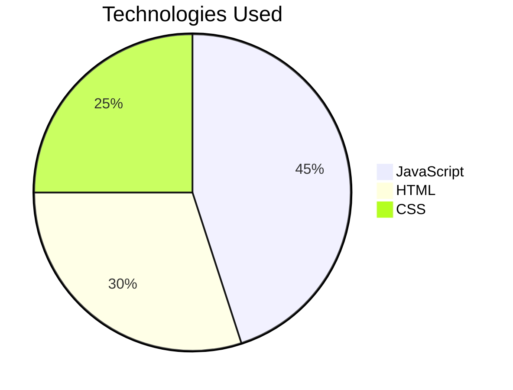

# 🎁 **Suspense Yes or No Game** - An Interactive Thriller Experience  

**Suspense Yes or No Game** is a thrilling interactive game featuring **"Yes or No"** questions wrapped in a *suspenseful* atmosphere, originally created as a special gift.

## 🌐 Play Online Now!
  
*(Available to play directly in your browser!)*

## 🎮 How to Play
1. Visit the link above or open `index.html`
2. Carefully follow the unfolding story
3. Answer **Yes/No** using the buttons
4. Discover how your choices affect the story's outcome

## 💡 Special Features
- **Suspense effects** using `setTimeout()`
- **Multiple endings** based on your decisions
- **Immersive design** that captures your attention
- **Gradual narration** as if someone is typing for you

## 🛠 Technologies Used

## 📌 About the Project
I developed this game as:
- A special gift for someone important
- A creative way to practice JavaScript
- An experiment with digital timing and suspense

"I wanted to create something more than just code - a memorable experience!"

## 👨‍💻 Creator
**Heitor Janko**  

> *"Digital gifts can carry as much meaning as physical ones - sometimes even more!"* ✨