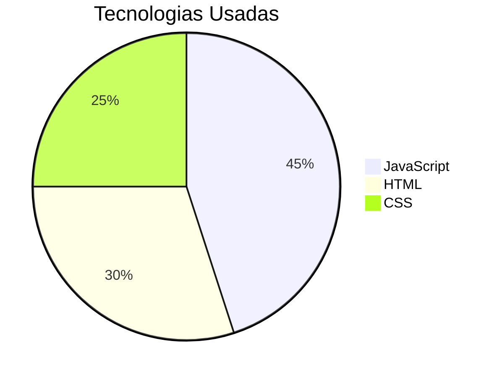

# 🎁 **Suspense Yes or No Game** - Um Jogo de Suspense Interativo  

**Suspense Yes or No Game** é um pequeno jogo com perguntas de **"Sim" ou "Não"** envolvido em um ambiente de *SUSPENSE* desenvolvido como presente especial. 

## 🌐 Jogue Agora Online!
  
*(Link disponível para jogar diretamente no navegador!)*

## 🎮 Como Jogar
1. Acesse o link acima ou abra `index.html`
2. Leia atentamente a história que se desenrola
3. Responda **Sim/Não** usando os botões
4. Descubra como suas escolhas afetam o destino da história.

## 💡 Recursos Especiais
- **Efeitos de suspense** com `setTimeout()`
- **Múltiplos finais** baseados nas suas decisões
- **Design imersivo** que prende sua atenção
- **Narração gradual** como se alguém estivesse digitando para você

## 🛠 Tecnologias

## 📌 Sobre o Projeto
Desenvolvi este jogo como:
- Presente especial para alguém importante
- Forma criativa de praticar JavaScript
- Experimento com timing e suspense digital

"Queria criar algo que fosse mais que código - uma experiência memorável!"

## 👨‍💻 Autor
**Heitor Janko**  

> *"Presentes digitais podem carregar tanto significado quanto os físicos - e às vezes até mais!"* ✨